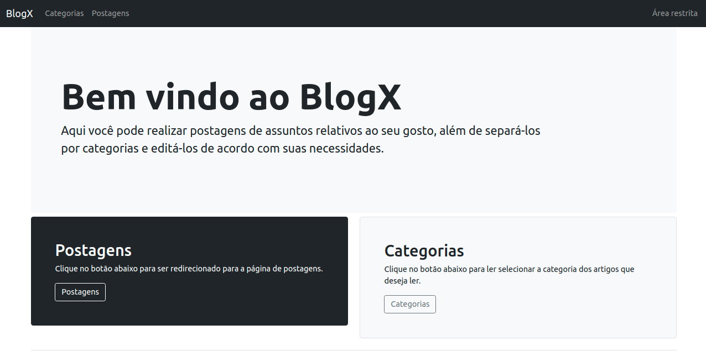

<h1 align="center">BlogX</h1>

A blog project developed with Node.JS, MySQL and Bootstrap. You can create, edit and delete your posts and add them separately by categories.

<h2>Next improvements</h2>

 - Add a seach bar
 - Improve the design

 <h2>Requeriments</h2>

 - Node.JS at v10.19.0
 - MySQL at version 8.0.26 for Linux on x86_64 (MySQL Community Server - GPL)
 - NPM at v7.17.0

<h2>Getting Started</h2>
 
  - For first, clone the repository;
  - Install the NPM dependencies: npm install;
  - Substitute the "#####" for your own MySQL password at /database/database;
  - Create 'blogx' database with your MySQL;
  - Uncomment line 15 at /categories/Category.js and /user/User.js;
  - Uncomment line 23 at /articles/Article.js;
  - Run the project server: node index.js;
  - Press ^C and comment the lines again;
  - So, rerun the project;
  - Lastly, open http://localhost:8080 with your browser;
